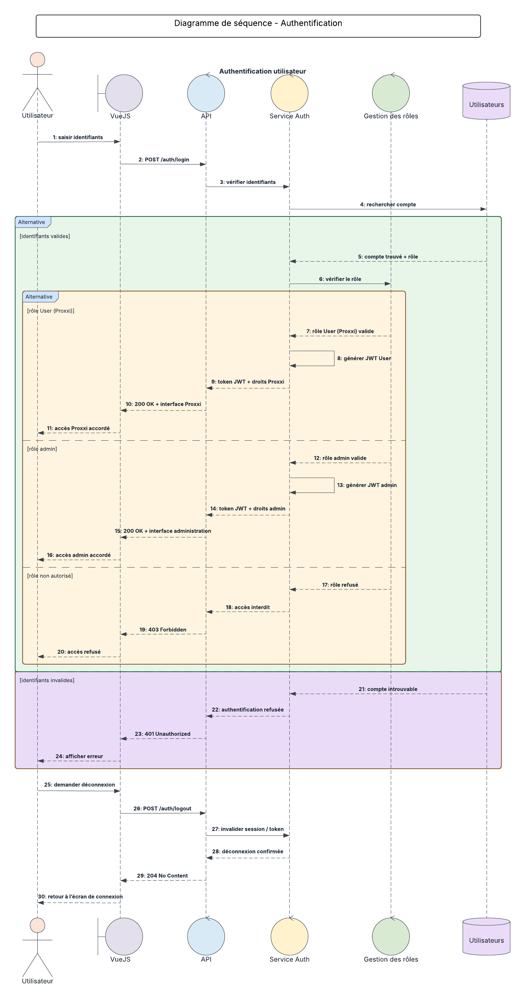
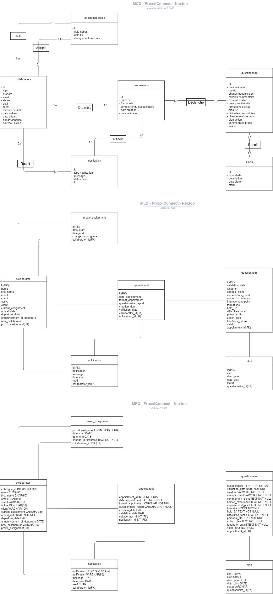

# ProxxiConnect

## Sommaire

1. [Présentation du projet](#1-présentation-du-projet)
2. [Formalisation du besoin fonctionnel](#2-formalisation-du-besoin-fonctionnel)
3. [Public cible](#3-public-cible)
4. [Définition du périmètre fonctionnel](#4-définition-du-périmètre-fonctionnel)
5. [MVP](#5-mvp)
6. [Parcours utilisateurs](#6-parcours-utilisateurs)
7. [Use Cases et diagrammes de séquence](#7-use-cases-et-diagrammes-de-séquence)
8. [Règles métier](#8-règles-métier)
9. [Modélisation des données](#9-modélisation-des-données)
10. [Contraintes du projet](#10-contraintes-du-projet)
11. [Architecture envisagée](#11-architecture-envisagée)
12. [Stack technique détaillée](#12-stack-technique-détaillée)
13. [Librairies importantes](#13-librairies-importantes)
14. [API externes](#14-api-externes)
15. [Notifications & reporting](#15-notifications--reporting)
16. [Numérique responsable](#16-numérique-responsable)
17. [Qualité, tests et sécurité](#17-qualité-tests-et-sécurité)
18. [Processus de développement](#18-processus-de-développement)
19. [Organisation projet et livraison](#19-organisation-projet-et-livraison)
20. [Pipeline CI/CD et déploiement](#20-pipeline-cicd-et-déploiement)
21. [Charte graphique](#21-charte-graphique)
22. [Wireframes](#22-wireframes)
23. [Conclusion](#23-conclusion)

---

# 1. Présentation du projet

## Nom du projet : ProxxiConnect

### Contexte

L'entreprise souhaite améliorer le suivi humain des collaborateurs en mission chez les clients ainsi qu'au centre de services (CDS).

Aujourd'hui, les échanges entre les Proxxi et les salariés existent déjà, mais les informations sont dispersées et difficilement exploitables.
Le suivi est principalement réalisé de manière informelle, ce qui limite :

- la visibilité globale sur l'état des collaborateurs ;
- le pilotage des actions de suivi ;
- la détection précoce des situations à risque ;
- la centralisation des comptes rendus ;
- la production de statistiques et de reportings fiables.

Le projet consiste donc à développer une application web permettant de centraliser les échanges entre les Proxxi et les collaborateurs afin de faciliter le suivi humain et le pilotage global du dispositif.

---

## Problématique ciblée

L'entreprise ne dispose actuellement d'aucun outil centralisé permettant :

- de suivre les échanges réalisés entre les Proxxi et les collaborateurs ;
- de détecter les situations de démotivation, d'isolement ou de burnout ;
- de visualiser les statistiques globales de suivi ;
- de garantir le respect des obligations liées aux rencontres annuelles ;
- de faciliter le reporting auprès des administrateurs ;
- de disposer d'un rappel pour les Proxxi et d'une vision sur leurs rendez-vous.

Le manque de centralisation rend également plus complexe :

- le suivi des actions à mettre en place ;
- l'historisation des échanges ;
- le pilotage de suivi sur l'exercice fiscal.

---

## Objectif du projet

Créer une plateforme web mobile-first permettant :

- aux Proxxi de suivre les collaborateurs qui leur sont attribués ;
- de saisir des comptes rendus après chaque échange ;
- de remplir des questionnaires standardisés ;
- d'identifier rapidement les situations sensibles ;
- de centraliser les informations ;
- de générer des statistiques et reportings globaux ;
- de suivre les obligations internes liées aux primes.

---

## Valeur principale apportée

ProxxiConnect apporte une vision centralisée et structurée du suivi humain des collaborateurs.

L'application permet :

- d'améliorer la proximité entre l'entreprise et les salariés ;
- de détecter plus rapidement les situations à risque ;
- de faciliter la communication interne ;
- de suivre les obligations de rencontres annuelles ;
- d'automatiser les rappels et notifications ;
- de produire des statistiques exploitables pour le pilotage RH et managérial.

---

## Fonctionnalité centrale du MVP

La fonctionnalité principale du MVP est :

> le suivi des échanges entre les Proxxi et les collaborateurs via des questionnaires standardisés associés à des rendez-vous.

Cette fonctionnalité inclut :

- la gestion des collaborateurs ;
- la gestion des rendez-vous ;
- la saisie des questionnaires ;
- le suivi des statistiques principales ;
- les rappels automatiques ;
- les alertes nouveau Proxxi au collaborateur ;
- les alertes administrateurs.

Le MVP doit rester volontairement simple afin de garantir :

- une réalisation réaliste ;
- une maintenance facilitée ;
- une bonne évolutivité du projet.

---

# 2. Formalisation du besoin fonctionnel

## Besoin utilisateur

Les Proxxi doivent pouvoir suivre facilement les collaborateurs qui leur sont attribués afin de maintenir une relation régulière et détecter rapidement les situations problématiques.

Aujourd'hui, les informations sont éparpillées entre différents supports et ne permettent pas d'obtenir une vision globale du suivi humain.

L'entreprise souhaite donc disposer d'un outil permettant :

- d'enregistrer chaque échange ;
- de conserver un historique des rencontres ;
- de centraliser les comptes rendus pour les administrateurs ;
- de produire des statistiques globales ;
- d'identifier rapidement les collaborateurs nécessitant une attention particulière ;
- de suivre les obligations liées aux primes internes.

Le besoin doit également répondre à plusieurs contraintes :

- accès mobile ;
- simplicité d'utilisation ;
- centralisation des données ;
- historisation des échanges ;
- notifications automatiques ;
- conservation des données pendant 5 ans.

---

# 3. Public cible

## Les administrateurs

Les administrateurs disposent d'un accès global à la plateforme.

Ils peuvent :

- gérer les affectations des collaborateurs ;
- consulter l'ensemble des questionnaires ;
- suivre les statistiques globales ;
- recevoir les alertes importantes, dont l'absence de Proxxi pour un collaborateur ;
- exporter les reportings.

Administrateurs identifiés :

- Sunita
- Christophe
- Cédric

---

## Les Proxxi

Les Proxxi assurent le suivi humain des collaborateurs.

Leur rôle consiste à :

- organiser les rencontres ;
- maintenir une proximité avec les salariés ;
- remplir les questionnaires après chaque échange ;
- remonter les éventuelles difficultés rencontrées ;
- relayer les informations de l'entreprise.

Chaque Proxxi possède uniquement accès aux collaborateurs qui lui sont attribués.

---

## Les salariés

Les salariés n'utilisent pas directement l'application.

Toutes les informations sont saisies uniquement par :

- les Proxxi ;
- les administrateurs.

---

## 3.1 Personas du projet

Afin de mieux comprendre les besoins des futurs utilisateurs, trois personas ont été définis. Ils orientent les choix fonctionnels et ergonomiques du projet.

- Sunita (42 ans, responsable suivi collaborateurs) : administratrice du dispositif, pilote les indicateurs globaux et prépare les reportings.
- Laura Bernard (31 ans, Proxxi et développeuse, 8 collaborateurs suivis) : utilise un lecteur d'écran, ce qui fait de l'accessibilité un enjeu clé de l'interface.
- Julien Petit (28 ans, développeur en mission client) : collaborateur suivi par un Proxxi, il n'utilise pas directement l'application.

[Persona #1 Sunita](/docs/00-/Personas/Persona_1_Sunita.md)

[Persona #2 Laura](/docs/00-/Personas/Persona_2_Laura.md)

[Persona #3 Julien](/docs/00-/Personas/Persona_3_Julien.md)

---

## 3.2 User Journey Global du projet

---

# 4. Définition du périmètre fonctionnel

## Priorisation des fonctionnalités - méthode MoSCoW

| Niveau      | Fonctionnalité                                                      |
|-------------|---------------------------------------------------------------------|
| Must Have   | Connexion via Google OAuth                                          |
| Must Have   | Gestion des Proxxi                                                  |
| Must Have   | Gestion des collaborateurs                                          |
| Must Have   | Attribution des collaborateurs à un Proxxi                          |
| Must Have   | Répondre au questionnaire                                           |
| Must Have   | Notifications email pour les administrateurs (questionnaire rempli) |
| Must Have   | Notifications email pour le collaborateur (nouveau Proxxi attribué) |
| Must Have   | Alertes rdv à planifier pour les Proxxi                             |
| Must Have   | Alertes questionnaire à remplir                                     |
| Must Have   | Application web (mobile-first)                                      |
| Must Have   | Suivi des 3 rendez-vous obligatoires                                |
| Should Have | Conservation des données                                            |
| Should Have | Tableau de bord                                                     |
| Should Have | Statistiques                                                        |
| Could Have  | Export PowerPoint .pptx                                             |
| Could Have  | Gestion des rendez-vous                                             |
| Won't Have  | Gestion des actions traitées / non traitées                         |
| Won't Have  | Comparaison entre exercices fiscaux                                 |

---

# 5. MVP

Le MVP se concentre sur :

- l'authentification Google ;
- la gestion des Proxxi et des collaborateurs, et l'attribution d'un collaborateur à un Proxxi ;
- la gestion des rendez-vous ;
- le questionnaire fixe ;
- les alertes administrateurs par mail (questionnaire rempli, collaborateur sans Proxxi) ;
- les alertes collaborateur par mail (nouveau Proxxi attribué) ;
- les rappels automatiques des RDV à planifier ;
- les rappels automatiques des questionnaires à remplir.

Le MVP doit permettre une première mise en production rapide tout en couvrant les besoins métiers essentiels.

---

# 6. Parcours utilisateurs

## Parcours : Connexion

### Acteur

Proxxi / Administrateur

### Étapes

1. L'utilisateur accède à l'application ;
2. Il se connecte via Google OAuth ;
3. Le système vérifie son rôle ;
4. L'utilisateur accède à son espace.

### Résultat attendu

Connexion sécurisée avec accès adapté au rôle utilisateur.

---

## Parcours : Création d'un compte rendu

### Acteur

Proxxi

### Étapes

1. Sélection du bouton « Questionnaire » dans les rappels Proxxi ;
2. Renseignement des champs (nom, prénom, client, mission actuelle, date et format du rendez-vous : restaurant, site client ou visio) ;
3. Remplissage du questionnaire ;
4. Validation définitive du formulaire ;
5. Suppression automatique de la notification suite à la validation du questionnaire ;
6. Alerte automatique envoyée aux administrateurs.

### Résultat attendu

Le questionnaire est enregistré et verrouillé définitivement.

---

## Parcours : Planifier un RDV

### Acteur

Proxxi

### Étapes

1. Sélection du bouton « Planifier un RDV » dans les rappels Proxxi ;
2. Choix de la date avec le date picker ;
3. Validation du RDV ;
4. Suppression automatique de la notification suite à la validation du RDV.

### Résultat attendu

Le rendez-vous est enregistré et la notification correspondante disparaît.

---

## Parcours : Consultation des statistiques

### Acteur

Administrateur

### Étapes

1. Accès au dashboard ;
2. Consultation des indicateurs ;
3. Filtrage par exercice fiscal ;
4. Analyse des graphiques ;
5. Export éventuel du reporting.

### Résultat attendu

Visualisation claire des données globales de suivi.

---

# 7. Use Cases et diagrammes de séquence

## Cas d'usage principaux par acteur

**Proxxi**

- Gérer mes collaborateurs attribués ;
- Remplir un questionnaire de suivi ;
- Consulter l'historique de ses échanges ;
- Recevoir un rappel après 2 mois sans rencontre.

**Administrateur**

- Gérer les affectations Proxxi ↔ collaborateurs ;
- Recevoir les alertes de questionnaire envoyé ;
- Consulter les questionnaires et statistiques ;
- Recevoir un email en cas d'absence de Proxxi.

## 7.1 Diagrammes de séquence

### Séquence : Authentification

### Séquence : Soumission du questionnaire

---

# 8. Règles métier

- Un collaborateur appartient à un seul Proxxi à la fois ;
- Les questionnaires sont fixes ;
- Un questionnaire validé ne peut plus être modifié ;
- Les salariés n'ont pas accès à l'application ;
- Les données doivent être conservées pendant 5 ans ;
- Chaque collaborateur doit être vu au minimum 3 fois par exercice fiscal ;
- L'exercice fiscal va du 1er août N-1 au 31 juillet N ;
- Les rappels sont envoyés automatiquement tous les 3 mois ;
- Un rappel supplémentaire est envoyé 2 mois après une rencontre ;
- Les administrateurs ont un accès global à la plateforme ;
- Les administrateurs reçoivent une alerte lorsqu'un questionnaire est soumis ;
- Les collaborateurs reçoivent une alerte lorsqu'une affectation de Proxxi leur a été attribuée ;
- Les Proxxi ne peuvent consulter que leurs propres collaborateurs ;
- Un doublon de questionnaire de suivi est défini par la même date et la même personne.

---

# 9. Modélisation des données

Le dictionnaire de données, le MCD, le MLD et le MPD détaillés sont disponibles en annexe technique.

---

# 10. Contraintes du projet

## Contraintes fonctionnelles

- application web responsive ;
- approche mobile-first ;
- simplicité d'utilisation ;
- accessibilité (voir section 16.2) ;
- performance correcte sur mobile.

---

## Contraintes techniques

- authentification Google OAuth ;
- stockage sécurisé des données ;
- export PowerPoint ;
- architecture évolutive ;
- API REST ;
- hébergement cloud.

---

## Contraintes réglementaires

- conservation des données pendant 5 ans ;
- respect du RGPD ;
- sécurisation des accès ;
- protection des données personnelles.

---

# 11. Architecture envisagée

L'application reposera sur une architecture web fullstack séparée :

- un frontend Vue.js 3 ;
- une API backend Spring Boot ;
- une base de données PostgreSQL.

## Communication

Le frontend communiquera avec le backend via une API REST sécurisée.

Le backend sera responsable :

- de l'authentification ;
- de la logique métier ;
- des notifications ;
- de l'accès aux données.

La base PostgreSQL stockera :

- les collaborateurs ;
- les affectations Proxxi ;
- les notifications ;
- les rendez-vous ;
- les questionnaires ;
- les alertes.

## Découpage backend

- Controller : expose l'API REST ;
- Service : porte la logique applicative ;
- Repository / Infra : isole la base et les API externes ;
- Mapper : centralise les conversions ;
- DTO / Model / Entity : sépare API, métier et persistance.

Objectifs : éviter d'exposer les entités JPA au front, limiter le couplage entre les couches, faciliter les tests et la maintenance.

## Découpage frontend

- Pages : écrans principaux de l'application ;
- Components : blocs UI réutilisables ;
- Stores Pinia : état partagé de l'application ;
- API clients : appels centralisés vers le backend ;
- Router : navigation et routes protégées ;
- Plugins / styles : Tailwind CSS, Shadcn Vue, thème et style global.

---

# 12. Stack technique détaillée

## Frontend

| Élément | Choix | Version | Justification |
|---|---|---|---|
| Langage | TypeScript | 5.x | Technologie déjà utilisée dans l'entreprise permettant de continuer à monter en compétence sur un environnement typé |
| Framework | Vue.js | 3.x | Framework déjà présent dans l'écosystème technique de l'entreprise et adapté à la création d'interfaces modernes |
| Build Tool | Vite | 6.x | Outil moderne offrant de bonnes performances de développement et déjà utilisé sur certains projets internes |
| CSS | Tailwind CSS | 4.x | Permet de développer rapidement une interface responsive et maintenable |
| UI Components | Shadcn Vue | dernière version stable | Accélère la création d'une interface cohérente et moderne |

---

## Backend

| Élément | Choix | Version | Justification |
|---|---|---|---|
| Runtime | Java | 25 LTS | Langage déjà utilisé dans l'entreprise permettant de rester cohérent avec l'environnement technique existant |
| Framework | Spring Boot | 3.x | Framework maîtrisé et utilisé en interne pour développer des APIs robustes et maintenables |
| Sécurité | Spring Security | 6.x | Intégration naturelle avec Spring Boot pour sécuriser l'application |
| Auth | Google OAuth2 | dernière version stable | Simplifie l'authentification grâce aux comptes Google professionnels déjà utilisés par les collaborateurs |
| API | REST | - | Architecture simple, standardisée et adaptée à une application web moderne |

---

## Base de données

| Élément | Choix | Version | Justification |
|---|---|---|---|
| SGBD | PostgreSQL | 17.x | Base de données robuste et déjà utilisée dans plusieurs projets de l'entreprise |
| ORM | Spring Data JPA | dernière version stable | Simplifie les accès aux données et s'intègre naturellement avec Spring Boot |
| Migrations | Liquibase | dernière version stable | Versionne le schéma de base de données |

---

## Outils de développement

| Élément | Choix | Version | Justification |
|---|---|---|---|
| Gestionnaire de paquets | pnpm | 10.x | Plus rapide et optimisé pour les projets JavaScript modernes |
| Versioning | Git | dernière version stable | Standard utilisé dans l'entreprise pour la gestion du code source |
| Conteneurisation | Docker | dernière version stable | Facilite la reproductibilité des environnements de développement et de déploiement |

---

# 13. Librairies importantes

## Frontend

- Vue Router
- Pinia
- Axios
- Zod
- VueUse
- TailwindCSS
- Chart.js

---

## Backend

- Spring Security
- Spring Data JPA
- MapStruct
- Jakarta Validation
- Java Mail Sender

---

# 14. API externes

ProxxiConnect s'appuie sur plusieurs API Google pour l'authentification, l'affichage du planning et la synchronisation de l'annuaire des collaborateurs.

| API | Utilisation | Authentification | Coût |
|---|---|---|---|
| Google Identity | Authentification des collaborateurs | OAuth 2.0 | Gratuit |
| Google Calendar API | Affichage du planning | OAuth 2.0 (calendar.readonly) | Gratuit (quotas Google Cloud) |
| Google Workspace Directory API | Synchronisation de l'annuaire interne | OAuth 2.0 / Service Account | Inclus avec Google Workspace |

Limitations à respecter :

- 240 appels en lecture par minute ;
- 120 appels en écriture par minute ;
- mise en cache (environ 1 minute) afin de limiter les appels et respecter les quotas Google Cloud.

---

# 15. Notifications & reporting

## Notifications prévues

### Pour les Proxxi

- rappel après 2 mois sans rencontre ;
- rappel des rendez-vous à planifier ;
- rappel des questionnaires à remplir.

### Pour les collaborateurs

- email lors de l'attribution d'un nouveau Proxxi.

### Pour les administrateurs

- alerte à chaque questionnaire soumis ;
- alerte lorsqu'un collaborateur n'a pas de Proxxi ;
- remontée des situations sensibles.

---

## Météo du suivi

Chaque questionnaire enregistre une météo de suivi, qui permet de détecter rapidement les situations sensibles et d'alimenter les statistiques globales :

- Ensoleillé ;
- Pluvieux ;
- Tornade ;
- Glacial.

---

## Reporting

Les administrateurs pourront consulter :

- nombre de réponses par météo ;
- nombre d'échanges par Proxxi ;
- évolution des suivis ;
- répartition des formats de rendez-vous.

Export prévu (Could Have) :

- PowerPoint (.pptx)

Hors périmètre (Won't Have pour l'instant) :

- comparaison entre exercices fiscaux.

---

# 16. Numérique responsable

## 16.1 Éco-conception

L'éco-conception consiste à réduire l'impact environnemental d'un service numérique tout au long de son cycle de vie, de sa conception jusqu'à sa fin de vie (extraction, fabrication et usage, transport, distribution, utilisation, fin de vie ou valorisation).

L'objectif est de proposer une application plus sobre, en optimisant les ressources et les performances, tout en conservant une bonne expérience utilisateur.

Outils d'analyse et de mesure :

- l'onglet Network des outils de développement, pour repérer les ressources trop lourdes, notamment les images ;
- l'onglet Performance, pour analyser les performances et la consommation de ressources ;
- l'onglet Memory, pour détecter d'éventuelles fuites mémoire ;
- Lighthouse, pour un audit des bonnes pratiques ;
- GreenIT-Analysis (extension Chrome), pour calculer un EcoIndex à chaque étape d'un parcours utilisateur.

Important : vider le cache du navigateur avant chaque analyse afin de simuler une première visite et obtenir des résultats comparables.

---

## 16.2 Accessibilité

L'objectif est de permettre à tous les collaborateurs d'utiliser l'application, quel que soit leur contexte d'usage.

Bonnes pratiques retenues (référentiel RGAA) :

- HTML sémantique et hiérarchie de titres cohérente ;
- navigation complète au clavier ;
- focus visible sur les éléments interactifs ;
- labels explicites sur les formulaires ;
- alternatives textuelles détaillées pour les images ;
- contrastes lisibles ;
- liens et boutons compréhensibles hors contexte.

Validation mise en place :

- ESLint a11y en local ;
- Playwright + axe en CI ;
- Lighthouse en CI ;
- WAVE, Accessibility Insights et contrôle humain avant mise en recette.

Objectif : détecter automatiquement les erreurs et valider humainement la pertinence réelle de l'interface.

---

## 16.3 Performance web

Mesures suivies :

- LCP : affichage du contenu principal ;
- INP : réactivité aux interactions ;
- CLS : stabilité visuelle de la page.

Points de vigilance : temps de réponse de l'API, poids JS / CSS / images, code inutile (à réduire par code splitting et tree shaking), traitements lourds sur le thread principal, absence de cache et appels API non limités.

Actions prévues : mesurer avec Lighthouse, DevTools et un monitoring réel, et surveiller les performances en CI pour éviter les régressions.

---

# 17. Qualité, tests et sécurité

## 17.1 Qualité du code

- SonarLint en local : détection des problèmes directement dans l'IDE avant commit ;
- ESLint côté front-end : règles Vue / TypeScript et règles d'accessibilité ;
- SonarQube en pipeline CI : bugs, vulnérabilités, code smells, duplication et couverture.

Couverture minimale obligatoire : 80 %. Dans la pipeline, une MR est bloquée si la Quality Gate n'est pas passée.

---

## 17.2 Stratégie de tests

- Tests unitaires : logique métier et règles de gestion (services, calculs, validations), couverture minimale de 80 % vérifiée par SonarQube.
- Tests end-to-end : Playwright simule les parcours utilisateurs complets, exécutés en CI, avec axe pour valider automatiquement les règles WCAG / RGAA.
- Tests manuels fonctionnels : recette sur l'ensemble de l'application pour détecter les régressions avant production.
- Tests manuels d'accessibilité : contrôle humain avec WAVE et Accessibility Insights avant recette.

---

## 17.3 Sécurité

- authentification Google et contrôle du domaine autorisé ;
- cookies sécurisés : HttpOnly, Secure, SameSite ;
- contrôles d'accès côté backend ;
- aucun secret dans le code ou les images Docker ;
- Trivy en pipeline : scan des dépendances Maven / npm et détection de secrets ;
- validation des entrées et protection des endpoints ;
- CORS restreint aux origines autorisées ;
- rate limit sur les endpoints ;
- erreurs utilisateur maîtrisées, sans stack trace ;
- revue de code : chaque MR vérifie les risques liés aux accès, secrets, dépendances, données, API et erreurs.

---

# 18. Processus de développement

## 18.1 Branches et merge requests

Branches :

- main : branche de production ;
- develop : branche de développement et de recette ;
- features : créées depuis develop.

Règles :

- toute évolution passe par une Merge Request dont la branche cible est develop ;
- les développements directs sur les branches principales sont interdits (sauf hotfix) ;
- la recette se fait sur develop avant de merger vers main.

Format de la MR :

- titre incluant la référence Jira, par exemple "PROXXI-123-Add-authentication" ;
- captures d'écran avant et / ou après pour les modifications front-end ;
- description avec le lien vers le ticket Jira.

---

## 18.2 Definition of Ready (DoR)

- le ticket Jira existe ;
- le besoin est compris ;
- les critères d'acceptation sont définis ;
- les informations nécessaires sont disponibles ;
- aucune question bloquante n'est présente.

---

## 18.3 Definition of Done (DoD)

- le développement est terminé et conforme aux critères d'acceptation ;
- le code respecte les standards du projet (qualité, sécurité, SonarQube, accessibilité et éco-conception) ;
- la fonctionnalité est vérifiée sur ordinateur et sur téléphone, et respecte les exigences d'accessibilité et de responsive design ;
- les commits, la branche et la MR sont documentés et liés au ticket Jira ;
- tous les tests sont réalisés et validés (automatiques et fonctionnels) ;
- la MR est revue et testée ;
- la fonctionnalité est déployée et validée en environnement de recette ;
- la documentation est mise à jour si nécessaire.

---

## 18.4 Recette fonctionnelle

À la fin de chaque sprint, les développements sont déployés sur le serveur de recette pour :

- vérifier le projet et valider les critères d'acceptation ;
- détecter les anomalies avant production.

Points vérifiés : comportement attendu, cas d'erreur principaux, affichage front-end, parcours utilisateur, accessibilité et absence de régression.

La mise en production n'est possible que si la fonctionnalité est validée en recette, qu'aucun bug n'est présent, que les anomalies détectées sont corrigées et que le ticket Jira est mis à jour.

---

# 19. Organisation projet et livraison

## Organisation agile

- priorisation par la valeur métier et la priorité ;
- livraison progressive et amélioration continue des pratiques ;
- découpage en sprints : prioriser, produire, tester, ajuster.

Cérémonies : Sprint Planning, Sprint Review, Rétrospective, Refinement / Backlog Grooming (préparation et clarification des futurs tickets).

## Roadmap

La roadmap du projet, avec les priorités des prochaines livraisons, est présentée dans le cahier des charges.

## Onboarding des futurs collaborateurs

- présentation du projet (contexte, objectifs et organisation) ;
- présentation de l'espace Confluence et de la documentation, avec une page « Livret d'accueil » ;
- accompagnement sur les premières tâches, adapté aux besoins ;
- sessions de pair programming pour la montée en compétences et le partage de connaissances.

---

# 20. Pipeline CI/CD et déploiement

## Pipeline CI

- Qualité : lint et type-check (ESLint, vue-tsc), formatage (Prettier), coverage (Jacoco, Vitest), analyse SonarQube et Quality Gate ;
- Fonctionnelle : tests unitaires (JUnit, Vitest), tests end-to-end et d'accessibilité (Playwright, axe-core) ;
- Sécurité : scan des dépendances et des secrets avec Trivy.

## Chaîne de déploiement continu

Déploiement continu sur Kubernetes : GitLab CI, SonarQube, Trivy, JIB / Nginx, ArgoCD.

- ArgoCD : plateforme GitOps qui gère le déploiement, les logs, les statuts, les pods et les événements Kubernetes. Il fonctionne avec des Helm Charts et met à jour values.yaml (images back et front) à partir d'un tag ;
- Outils : Maven, JIB, Java (backend) ; pnpm, Nginx (frontend) ; GitLab CI et ArgoCD (CI/CD) ; Trivy (sécurité) ; SonarQube (qualité) ; Kubernetes (orchestration).

Déroulement : un tag GitLab est créé une fois les tests OK et Trivy sans faille critique, puis back et front sont synchronisés indépendamment dans ArgoCD. Le dernier tag est pris par défaut, les tags front et back n'étant pas liés.

En cas d'erreur visible dans les logs, la correction se fait sur une branche dédiée, puis est mergée dans develop. Un nouveau tag doit ensuite être créé pour relancer le déploiement. Lors de l'étape de Build, le processus peut effectuer plusieurs tentatives automatiques avant d'afficher l'erreur : l'échec peut donc n'apparaître qu'après quelques minutes.

---

# 21. Charte graphique

## Identité visuelle

L'interface devra respecter l'identité graphique de Nextoo afin de conserver une cohérence avec l'écosystème de l'entreprise.

---

## Couleurs principales

| Couleur | Code | Usage |
|---|---|---|
| Bleu Galactique | #1A2A4A | Texte, sous-titres, fonds secondaires |
| Rouge T65 | #C8102E | Titres, éléments importants |
| Blanc Stormtrooper | #F5F4F0 | Fonds principaux |

---

## Typographies

| Typographie | Usage |
|---|---|
| Montserrat Regular | Paragraphes et contenus |
| Montserrat Semi-Bold | Boutons et mise en avant |
| Krona One | Titres et sous-titres |

---

# 22. Wireframes

Les sept écrans clés sont conçus mobile-first, dans le respect de la charte graphique Nextoo. TODO : Les maquettes Figma sont en cours de révision suite aux retours de la présentation.

Écran de connexion :

Tableau de bord :

Mes collaborateurs :

Mes rendez-vous :

Retour Proxxi :

Assigner à un Proxxi :

Synthèse retour Proxxi :

---

# 23. Conclusion

ProxxiConnect répond à un besoin concret de centralisation du suivi humain des collaborateurs.

Le projet vise à fournir un outil :

- simple ;
- structuré ;
- mobile-first ;
- évolutif ;
- exploitable par les Proxxi et les administrateurs.

Le MVP permettra de couvrir les besoins essentiels :

- suivi des échanges ;
- questionnaires ;
- statistiques ;
- alertes ;
- reporting.

---

## Contact

**Amandine Delbouve (Kemp)** : Développeuse

