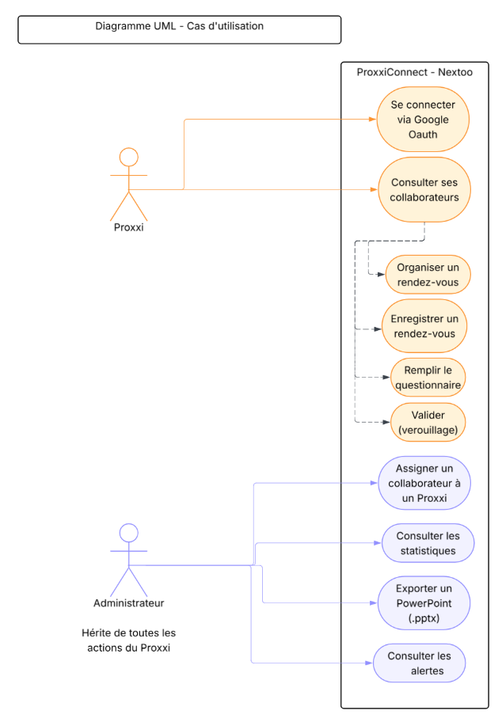

# Cahier des charges - Projet ProxxiConnect
### Nextoo – Plateforme de suivi humain des collaborateurs en mission

---

## 1. Expression du besoin

### 1.1 Contexte

Nextoo est une société de conseil qui place des collaborateurs (consultants) en mission chez des clients (Decathlon, BNP Paribas, SNCF, Leroy Merlin, CapGemini, etc.).
Pour maintenir un lien humain avec ces collaborateurs, l'entreprise s'appuie sur des référents internes appelés **Proxxi**, chargés d'organiser des rendez-vous réguliers de suivi (en restaurant, sur site client, ou en visio).

### 1.2 Problématique

Aujourd'hui, ce suivi repose entièrement sur des pratiques manuelles et non centralisées :

- **8 Proxxi** suivent à eux seuls **88 collaborateurs** en mission, sans outil commun.
- Les échanges terrain (comptes-rendus de RDV) ne sont ni tracés, ni analysables dans la durée.
- Il est impossible de détecter rapidement les signaux faibles de mal-être (burnout, démotivation, isolement) chez un collaborateur, faute de centralisation des retours.
- Le reporting vers les administrateurs RH est réalisé manuellement, ce qui est chronophage et source d'erreurs.
- Une prime de suivi, conditionnée à la réalisation d'un minimum de **3 rendez-vous par exercice fiscal** et par collaborateur, n'est actuellement pas trackée, ce qui pénalise potentiellement les Proxxi.

**Pour qui :** les 8 Proxxi (utilisateurs terrain) et les 3 administrateurs (Sunita, Christophe, Cédric), qui pilotent le dispositif de suivi à l'échelle de l'entreprise.

**Pourquoi :** garantir un suivi humain réel et mesurable des collaborateurs en mission, sécuriser le versement des primes liées au suivi, et permettre une détection précoce des situations à risque.

### 1.3 Réponse apportée par ProxxiConnect

ProxxiConnect est une application web interne, mobile-first, qui centralise l'ensemble du processus de suivi :

- structuration des rendez-vous Proxxi/collaborateur via un questionnaire standardisé post-RDV,
- calcul automatique de l'avancement de chaque collaborateur vis-à-vis du quota de 3 RDV par exercice fiscal,
- remontée automatique d'alertes en cas de signal de risque détecté dans les réponses,
- tableaux de bord et statistiques pour les administrateurs,
- export des synthèses de suivi au format PowerPoint (.pptx) pour les RH.

> **Slogan :** *« Un suivi plus proche, des équipes plus fortes. »*
> **Valeurs :** Suivi · Proximité · Performance

---

## 2. Cahier des charges fonctionnel

### 2.1 Fonctionnalité principale : le questionnaire de suivi RDV

C'est le **cœur de valeur** de l'application : sans ce questionnaire structuré, il n'y a ni traçabilité, ni détection de risque, ni statistiques fiables. Toutes les autres fonctionnalités (tableaux de bord, alertes, exports) sont construites à partir des données qu'il génère.

Le questionnaire est rempli par le Proxxi immédiatement après chaque rendez-vous et se découpe en trois blocs :

**Bloc 1 — Identification**
- Format du rendez-vous (restaurant, site client, visio)
- Date de validation du RDV
- Identification du collaborateur et de la mission en cours

**Bloc 2 — L'échange**
- « Météo » du collaborateur (indicateur de ressenti : Ensoleillé, Pluvieux, Glacial, Tornade)
- Éventuel changement de mission ou commentaire sur la mission
- Ressenti vis-à-vis de Nextoo
- Difficultés rencontrées, changements de vie personnelle signalés
- Alertes commerciales pré-RDV (informations à vérifier ou aborder avant le rendez-vous)

**Bloc 3 — Suivi et actions**
- Points d'amélioration identifiés
- Formations suivies / à prévoir
- Aide BA (bilan annuel) si besoin
- Plan d'action pour la suite
- Commentaire libre du Proxxi
- Validation et verrouillage du compte-rendu

Ce questionnaire déclenche automatiquement, un email transmis aux administrateurs. Une fois validé, un questionnaire ne peut plus être modifié.

### 2.2 Fonctionnalités secondaires

| Fonctionnalité | Description |
|---|---|
| Tableaux de bord | Statistiques météo, comparatifs entre collaborateurs (côté Admin),  prochains RDV à planifier (côté Proxxi) |
| Suivi du quota de primes | Indicateur « RDV réalisés / RDV attendus par exercice fiscal » (ex. 2/3) affiché par collaborateur. L'exercice fiscal court du 1er août N-1 au 31 juillet N |
| Notifications | Rappel automatique tous les 3 mois, complété par un rappel supplémentaire 2 mois après une rencontre, pour garantir le respect du quota de suivi |
| Détection des risques | Remontée automatique d'alertes (burnout, démotivation, isolement) à partir des réponses au questionnaire |
| Authentification | Connexion sécurisée via Google OAuth (compte Nextoo) |
| Export reporting | Génération de synthèses au format PowerPoint (.pptx) pour Sunita qui s'occupe du pilotage Proxxi |

### 2.3 Acteurs et droits d'accès

**Proxxi** *(8 comptes actifs)*
- Organiser les rendez-vous avec ses collaborateurs assignés
- Remplir le questionnaire de suivi post-RDV
- Consulter la liste et le statut de ses collaborateurs assignés
- Consulter son propre tableau de bord

**Administrateur** *(3 comptes : Sunita, Christophe, Cédric)* - hérite de toutes les actions du Proxxi, plus :
- Assigner un collaborateur à un Proxxi
- Consulter l'ensemble des résultats et statistiques, tous Proxxi confondus
- Recevoir et traiter les alertes remontées par le système
- Exporter les synthèses de reporting au format PowerPoint

> **Note :** les collaborateurs suivis n'utilisent pas directement l'application ; ils sont uniquement les sujets du suivi réalisé par les Proxxi.

### 2.4 Cas d'utilisation (synthèse UML)

**Acteur « Proxxi »**
Se connecter via Google OAuth → consulter ses collaborateurs → organiser un rendez-vous → enregistrer le rendez-vous → remplir le questionnaire → valider (verrouillage du compte-rendu).

**Acteur « Administrateur »** *(hérite du Proxxi)*
Assigner un collaborateur à un Proxxi, consulter les statistiques globales, exporter un reporting PowerPoint, consulter et traiter les alertes.

### 2.5 Modèle de données (aperçu MCD)

**Entités principales et relations**
- Collaborateur (1,n) — *Organise* — Rendez-vous (1,1)
- Rendez-vous (1,1) — *Déclenche* — Questionnaire (1,1)
- Questionnaire (0,n) — *Reçoit* — Alerte (1,1)
- Collaborateur (0,n) — *Suit* — Affectation Proxxi (1,1)
- Proxxi — *Assigné* — Affectation Proxxi
- Collaborateur / Rendez-vous (0,n) — *Reçoit* — Notification (1,1)

**Principaux attributs**

| Entité | Attributs |
|---|---|
| **Collaborateur** | id, nom, prénom, email, statut, actif, client, mission actuelle, date d'arrivée, date de départ, départ annoncé, nouveau collaborateur |
| **Rendez-vous** | id, date RDV, format RDV, compte-rendu questionnaire, date de création, date de validation |
| **Questionnaire** | id, date de validation, météo, changement de mission, commentaire mission, ressenti Nextoo, points d'amélioration, formations suivies, aide EAE, difficultés rencontrées, changement vie perso, plan d'action, commentaire Proxxi, validé |
| **Alerte** | id, type alerte, description, date alerte, statut |
| **Notification** | id, type notification, message, date d'envoi, lu |
| **Affectation Proxxi** | id, date début, date fin, changement en cours |

---

## 3. Cahier des charges technique

### 3.1 Frontend

| Élément | Choix | Version | Justification |
|---|---|---|---|
| Langage | TypeScript | 5.x | Technologie déjà utilisée dans l'entreprise, permettant de continuer à monter en compétence sur un environnement typé |
| Framework | Vue.js | 3.x (Composition API) | Framework déjà présent dans l'écosystème technique de l'entreprise, adapté à une application mobile-first avec de nombreux formulaires dynamiques (questionnaire multi-blocs, tableaux de bord) |
| Build Tool | Vite | 6.x | Outil moderne offrant de bonnes performances de développement, déjà utilisé sur certains projets internes |
| CSS | Tailwind CSS | 4.x | Permet de développer rapidement une interface responsive et maintenable |
| UI Components | Shadcn Vue | dernière version stable | Accélère la création d'une interface cohérente et moderne |

**Bibliothèques principales :** Vue Router (navigation), Pinia (gestion d'état), Axios (appels API), Zod (validation des formulaires), VueUse (utilitaires réactifs), Chart.js (visualisation des statistiques).

Approche **responsive / mobile-first**, les Proxxi étant amenés à remplir les comptes-rendus depuis un mobile immédiatement après le rendez-vous (restaurant, site client).

### 3.2 Backend

| Élément | Choix | Version | Justification |
|---|---|---|---|
| Runtime | Java | 21 LTS | Langage déjà utilisé dans l'entreprise, cohérent avec l'environnement technique existant |
| Framework | Spring Boot | 3.x | Framework maîtrisé et utilisé en interne pour développer des API robustes et maintenables, avec une architecture en couches claire (contrôleurs, services, repositories, entités, mappers) |
| Sécurité | Spring Security | 6.x | Intégration naturelle avec Spring Boot pour sécuriser l'application et gérer les rôles Proxxi/Administrateur |
| Auth | Google OAuth2 | dernière version stable | Simplifie l'authentification grâce aux comptes Google professionnels déjà utilisés par les collaborateurs Nextoo |
| API | REST | - | Architecture simple, standardisée et adaptée à une application web moderne |

**Bibliothèques principales :** Spring Security (authentification/autorisation), Spring Data JPA (accès aux données), MapStruct (mapping entités/DTO), Jakarta Validation (validation des données), Java Mail Sender (envoi des notifications par email).

**Architecture en couches :** entités JPA, repositories Spring Data JPA, services métier, mappers, contrôleurs REST.

### 3.3 Base de données

| Élément | Choix | Version | Justification |
|---|---|---|---|
| SGBD | PostgreSQL | 17.x | Base de données robuste, déjà utilisée dans plusieurs projets de l'entreprise, adaptée à un modèle de données fortement relationnel (collaborateurs, affectations, rendez-vous, questionnaires, alertes) |
| ORM | Spring Data JPA | dernière version stable | Simplifie les accès aux données et s'intègre naturellement avec Spring Boot |

Politique de conservation des données fixée à **5 ans**, conforme aux exigences RH internes de traçabilité et au RGPD.

### 3.4 Authentification et sécurité

- **Authentification :** Google OAuth2, restreinte aux comptes Google du domaine Nextoo.
- **Justification :** évite la gestion d'un système de mots de passe propriétaire, s'appuie sur l'infrastructure d'identité déjà utilisée en interne (comptes Google professionnels Nextoo), et simplifie la gestion des habilitations par rôle (Proxxi / Administrateur).
- Gestion des rôles et permissions via **Spring Security 6.x** (contrôle d'accès basé sur les rôles).
- Sécurisation des accès et protection des données personnelles conformément au RGPD.

### 3.5 Outils, environnement et intégration continue

| Élément | Choix | Version | Justification |
|---|---|---|---|
| Gestionnaire de paquets | pnpm | 10.x | Plus rapide et optimisé pour les projets JavaScript modernes |
| Versioning | Git | dernière version stable | Standard utilisé dans l'entreprise pour la gestion du code source |
| Conteneurisation | Docker | dernière version stable | Facilite la reproductibilité des environnements de développement et de déploiement |

**Tests backend :** JUnit 5 et Mockito, avec une convention de nommage des méthodes de test en `should_*` et une organisation des classes de test en `@Nested`, garantissant une couverture claire par cas fonctionnel.

### 3.6 Services externes

- Génération de fichiers PowerPoint (.pptx) pour l'export des synthèses de reporting à destination des comités RH.
- Envoi des notifications par email via Java Mail Sender.
- API Google OAuth2 pour l'authentification.

### 3.7 Charte graphique, ergonomie et éco-conception (contraintes transverses)

#### Contraintes transverses
   **Contrainte**       | **Description**                                                                                                                                                                                                 |
 |----------------------|-----------------------------------------------------------------------------------------------------------------------------------------------------------------------------------------------------------------|
| **Mobile-first**     | Interface pensée pour une saisie rapide en situation de mobilité (ex. : remplir le questionnaire juste après un rendez-vous). |
| **Accessibilité**    | Respect des bonnes pratiques WCAG (contrastes, tailles de texte, navigation clavier) pour garantir une utilisation inclusive.                                                                                   |
| **Éco-conception**   | Réduction de l'empreinte environnementale de l'application :
- Optimisation des requêtes backend (pagination, cache) et frontend (lazy loading, compression des assets) pour limiter la consommation énergétique.
- Limitation du stockage des données (politique de conservation à **5 ans**, conforme au RGPD).
- Design sobre : couleurs et polices définies pour minimiser le poids visuel (évitement des animations énergivores). |

#### Couleurs
| **Couleur**            | **Usage**                          |
 |------------------------|------------------------------------|
| Bleu Galactique `#0B3B68` | Texte, sous-titres, fonds secondaires |
| Rouge T65 `#BF2D18`    | Titres, éléments importants        |
| Blanc Stormtrooper `#F9F9F9` | Fonds principaux |

#### Typographie
| **Typographie**        | **Usage**                          |
 |------------------------|------------------------------------|
| Montserrat Regular     | Paragraphes et contenus            |
| Montserrat Semi-Bold   | Boutons et mise en avant           |
| Krona One              | Titres et sous-titres              |
